# 🚀 壹孪(OneTwin) - 企业级低代码数字孪生可视化大屏

> 构建高保真、可交互的企业级数字孪生平台

融合三维可视化、实时数据与 AI 智能，驱动制造、能源、园区等场景的数字化闭环运营

[](https://onetwin.cn)
[](https://onetwin.cn/docs)
[](https://gitee.com/wei_feng_qin/wantonly-drag-open)
[](https://github.com/1035141145/wantonly-drag-open)

---

## 🚀简介

本项目提供企业级低代码数据可视化大屏解决方案，通过简单的拖拉拽操作即可生成精美的看板。项目旨在解决企业可视化大屏**开发过程繁琐**、**开发成本高**、**维护成本高**等问题。基于多年经验，我们发现企业投入大量精力开发的大屏常因生产变化导致维护困难，最终沦为**面子工程**。本解决方案能有效解决这些问题，助推企业数字化转型。

#### 个人项目，完全自己一个人独立自主开发，招合作伙伴，招投资，如果您看好这个项目，我们能有可能得一切合作模式。


---

## 📖 行业核心痛点

| 痛点     | 传统方案   | 壹孪方案       |
| -------- | ---------- | -------------- |
| 开发周期 | 数周至数月 | **小时级**     |
| 开发成本 | 高昂       | **低成本**     |
| 维护难度 | 困难       | **可视化维护** |

---

## ✨ 壹孪(OneTwin)核心优势

| 特性 | 说明 |
|------|------|
| 🎯 **零代码搭建** | 拖拽式配置，30 分钟快速还原工厂、园区、设备等物理场景 |
| 🤖 **AI 智能生成** | 集成 DeepSeek 大模型，自然语言一键生成 3D 组件 |
| ⚡ **毫秒级同步** | 对接 IoT/ERP/MES 系统，实现业务状态实时映射与预警 |
| 🔄 **跨行业复用** | 预置制造、电力、仓储、交通等行业模板，开箱即用 |
| 🥽 **沉浸式仿真** | 支持 Web 端全景漫游、AR 巡检、应急预案推演 |

---

## 🖼️ 效果预览

<details>
<summary>📸 新版本预览图</summary>

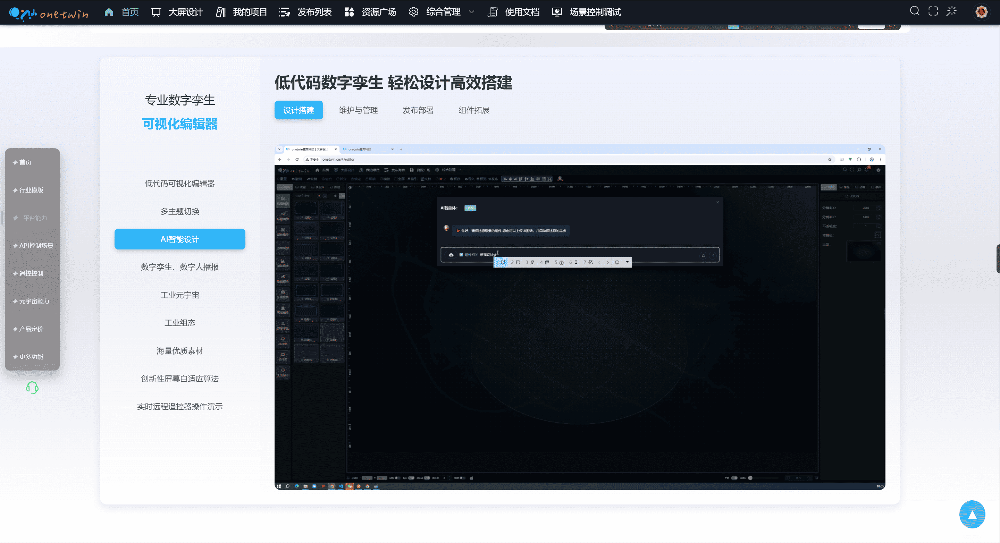
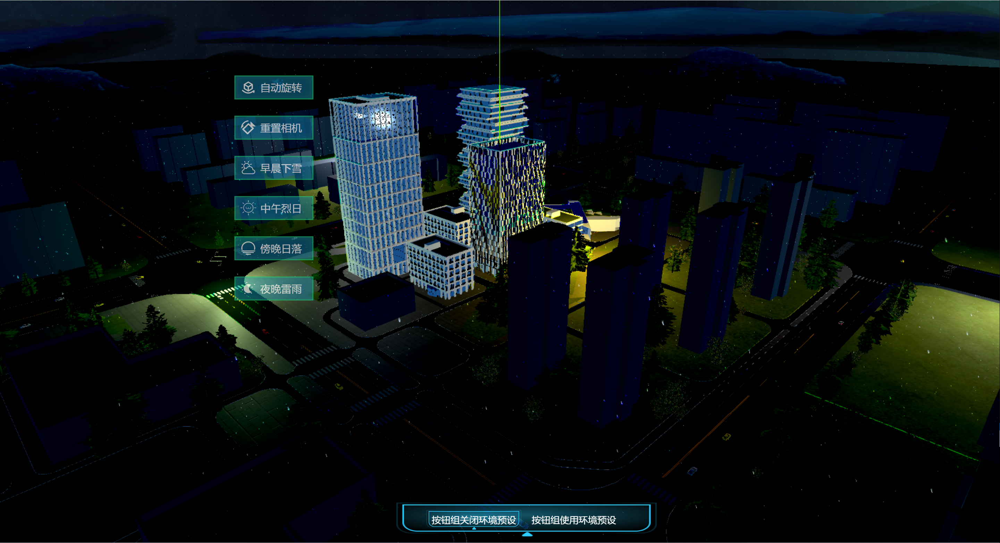
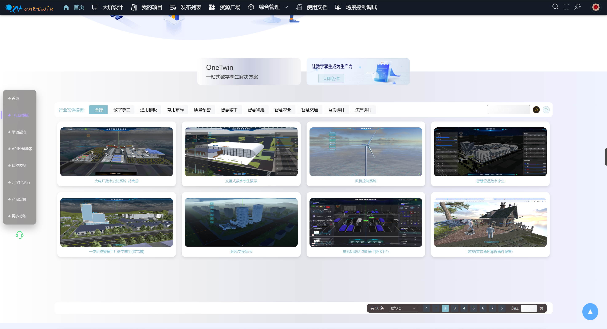

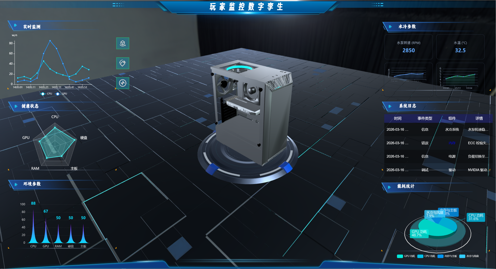
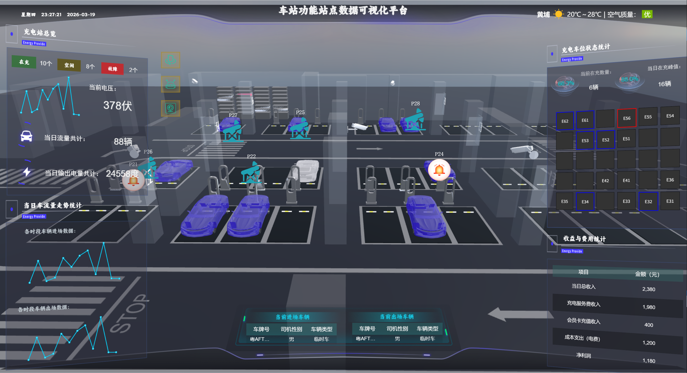
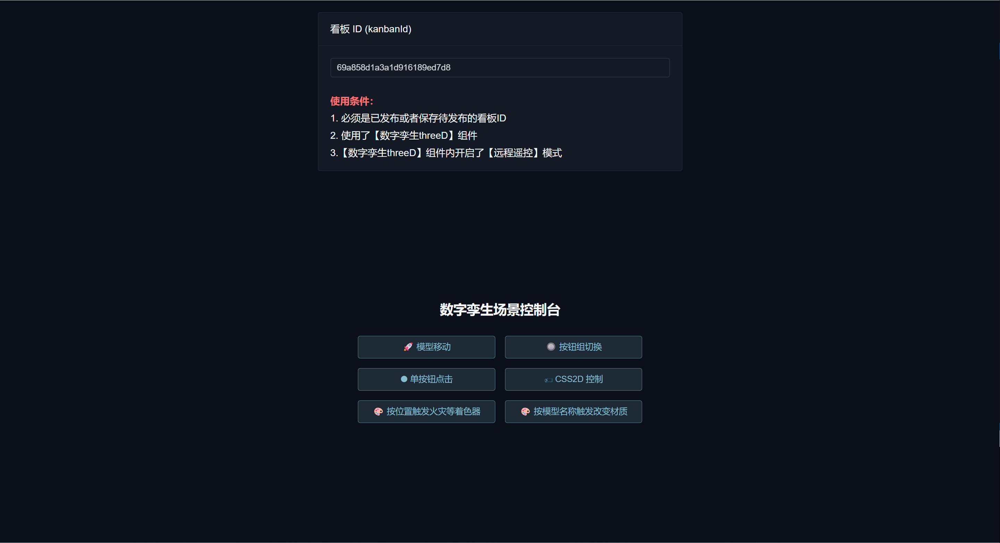
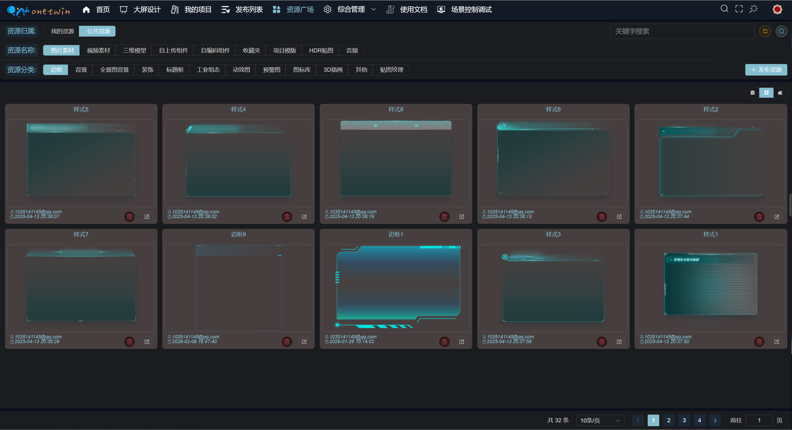
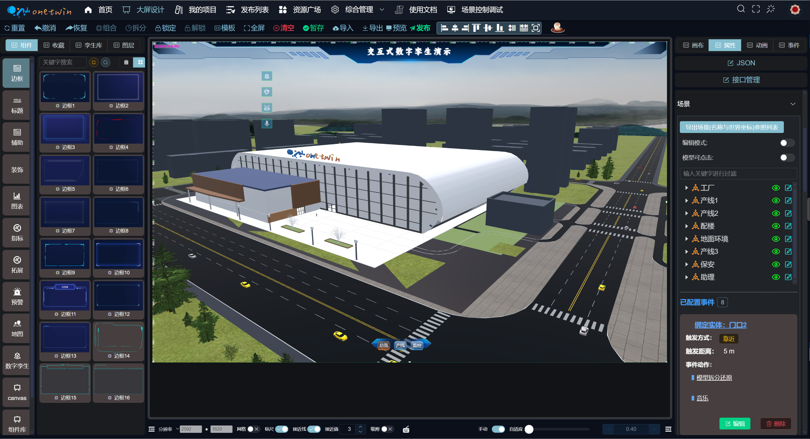
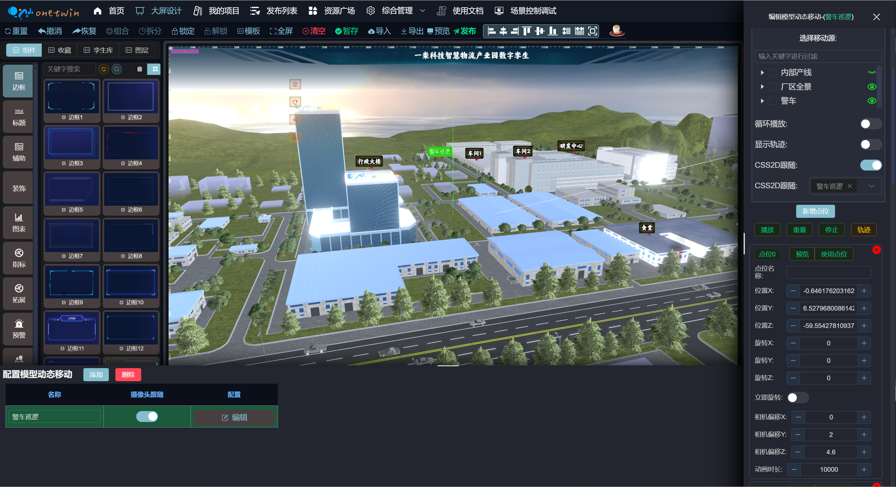
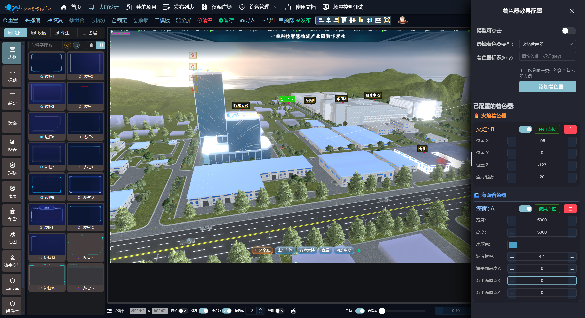
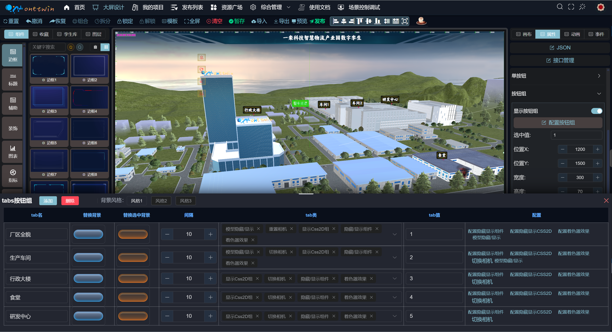
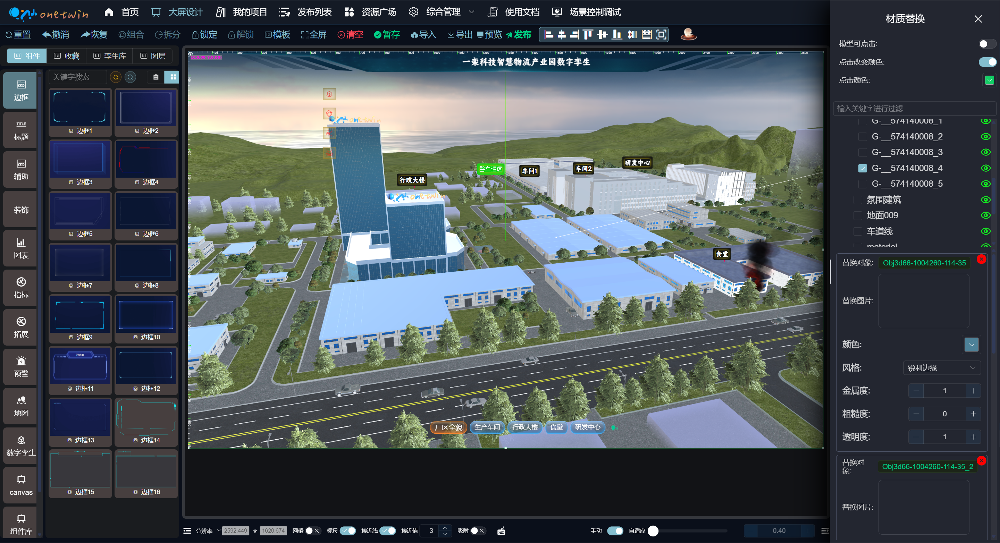

</details>

<details>
<summary>📸 旧版本预览图</summary>


</details>

## 🌐 版本对比

| 特性   | 旧版本         | 新版本 (壹孪)           |
| ------ | -------------- | ----------------------- |
| 技术栈 | Vue2 + Webpack | **Vue3 + Vite + Pinia** |
| 体验   | 基础           | **流畅 + 美观**         |
| 数据   | 共享           | **用户独立**            |
| 费用   | 个人免费              | **个人免费**            |
| 私有化部署   | 支持      | **支持**         |
| 独立项目导出   | -       | **支持**            |
| 三维孪生场景设计  | 丰富     | **覆盖大部分场景需求**         |
| 模型编辑器  | -     | **支持**         |
| AI智能设计   | -      | **支持**         |
| 远程遥控   | -      | **支持**         |
| API操作场景  | -       | **支持**         |
| 源码购买  | 支持       | **大型企业用户支持** / **支持版权买断**       |


### 快速体验

| 版本 | 地址                                                | 账号                                                                      | 密码     |
| ---- | --------------------------------------------------- | ------------------------------------------------------------------------- | -------- |
| 旧版 | [wantonly-drag.com.cn](http://wantonly-drag.com.cn) | `123456@qq.com`                                                           | `123456` |
| 新版 | [onetwin.cn](https://onetwin.cn)                     | `test` | `123456` |

---

## ✨ 核心功能


### 整体功能详情

| 功能点         | 旧版本 | 新版本   |
| -------------- | ------ | -------- |
| 组态编辑器   | ✅     | ✅**美观**       |
| 组件丰富度     | ✅基础   | ✅**增强** |
| 模板数量       | ✅有限   | ✅**丰富** |
| 组件联动       | ✅     | ✅       |
| 拖拽旋转       | ✅     | ✅       |
| 快捷键操作     | ✅     | ✅       |
| 绑定事件       | ✅     | ✅       |
| 绑定动画       | ✅     | ✅       |
| 图层管理       | ✅     | ✅       |
| 组件三维样式转换     | ✅     | ✅       |
| 复制粘贴剪切   | ✅     | ✅       |
| 组件组合拆分   | ✅     | ✅       |
| 锁定组件       | ✅     | ✅       |
| 组件调用接口   | ✅     | ✅       |
| 统一接口管理   | ❌     | ✅       |
| 图片素材维护     | ✅     | ✅       |
| 视频素材维护     | ✅     | ✅       |
| 三维模型维护     | ✅     | ✅       |
| 音频素材维护     | ❌    | ✅       |
| HDR素材维护     | ❌     | ✅       |
| 收藏夹维护     | ✅     | ✅       |
| 跨框架上传组件拓展     | ✅     | ✅       |
| 在线编码拓展组件 | ✅     | ✅       |
| 权限管控       | ✅     | ✅       |
| 发布公告       | ✅     | ✅       |
| 单大屏一键导出独立部署       | ❌     | ✅       |
| AI智能设计       | ❌     | ✅       |
| Ccesium.js孪生组件       | ✅     | ✅       |
| Three.js孪生组件       | ✅     | ✅**增强**       |
| 模型编辑器       | ❌     | ✅       |
| 远程遥控       | ❌     | ✅       |
| API操作场景     | ❌     | ✅       |
| API场景控制调试器       | ❌     | ✅       |

---

### 🌐 孪生功能详情

| 功能点 | 旧版本 | 新版本 | 说明 | 使用场景 |
|:-------|:------:|:------:|:-----|:---------|
| **三维模型导入** | ✅ | ✅ | 支持 `.glb`, `.gltf` 等 web 端主流格式 | 工厂设备、建筑、车辆模型加载 |
| **模型动画播放** | ✅ | ✅ | 支持模型自带动画的播放和播放相关参数 | 机械臂运转、人物行走、设备开合 |
| **相机配置** | ✅ | ✅ | 调整相机到合适位置 | 最佳观察角度、特写镜头设定 |
| **背景配置** | ✅ | ✅增强 | 设置场景的背景，支持全景图片，(✨新版本支持 HDR) | 园区全景、天空盒、HDR 环境映射 |
| **控制器配置** | ✅ | ✅增强 | 设置轨道控制器，缩放、阻尼、自动旋转等，（✨新版本支持限制控制器俯仰角） | 缩放阻尼、自动旋转、俯仰角限制 |
| **二维孪生交互** | ✅ | ✅ | 任意二维组件都可以嵌入到三维场景中自定义点位，并实现交互。二维组件配置了接口就可以实现传感器等数据展示，实现二维与三维的完美融合 | 传感器数据面板、图表悬浮显示等 |
| **三维孪生交互** | ✅ | ✅ | 与二维孪生交互类似，三维交互不会随着摄像机转动，嵌入实体场景中，实现三维场景的交互 | 嵌入广告牌、广告视频播放等 |
| **辅助器配置** | ✅ | ✅ | 设置网格、坐标轴、帧率、视图辅助器等 | 开发调试、空间定位参考 |
| **单按钮配置** | ✅ | ✅增强 | 在场景中添加按钮，可配置点击事件 <br/>（旧版本：自动旋转、重置相机、切换相机、机器人巡检、模型拆分还原） <br/>（✨新版本：自动旋转、重置相机、切换相机、机器人巡检、模型拆分还原、播放停止动画、音乐、环境效果、材质替换还原、模型隐藏\显示、摄像头动画轨迹） | 相机切换、动画控制、效果触发 |
| **按钮组配置** | ✅ | ✅增强 | 在场景中添加按钮组，可配置点击事件  <br/>（旧版本：显示隐藏组件、显示隐藏 CSS2D 组、切换相机、机器人巡检、模型变换位置、播放停止动画、显示隐藏模型） <br/>（✨新版本：显示隐藏组件、显示隐藏 CSS2D 组、切换相机、机器人巡检、模型变换位置、播放停止动画、显示隐藏模型、模型拆分还原、播放停止动画、音乐、环境效果、材质替换还原、模型隐藏\显示、摄像头动画轨迹） | 多功能控制面板、批量场景事件控制 |
| **模型编辑器** | ❌ | ✅ | 内置轻量级模型编辑器，支持多种模型变换操作 | 模型位置、旋转、缩放调整 |
| **模型旋转/缩放/平移** | ✅ | ✅ | 轻量调整模型大小、位置、旋转，可不借助模型编辑器 | 模型布局调整、场景搭建 |
| **模型层级管理** | ✅ | ✅增强 | 可展开/折叠模型结构树，支持绑定事件 | 复杂模型组织、事件绑定 |
| **模型事件 - 点击** | ✅ | ✅增强 | 旧版本：触发 CSS2D。新版本：触发 CSS2D、触发 CSS3D、模型拆分还原、播放停止动画、音乐、环境效果、材质替换还原、模型隐藏\显示 | 模型高亮、信息弹窗、动画触发 |
| **模型事件 - 角色靠近** | ❌ | ✅ | 触发 CSS2D、触发 CSS3D、模型拆分还原、播放停止动画、音乐、环境效果、材质替换还原、模型隐藏\显示 | 自动讲解、区域预警、互动触发 |
| **灯光配置** | ✅ | ✅ | 支持环境光、点光源、平行光、聚光灯等类型 | 日夜切换、重点照明、氛围营造 |
| **雾效果设置** | ❌ | ✅ | 支持线性雾、指数雾，增强空间感 | 远景模糊、大气透视、神秘氛围 |
| **后处理设置** | ❌ | ✅ | 支持辉光强度、亮度、对比度、饱和度、黑白度、怀旧感、怀旧感等场景效果配置，预设：赛博朋克、冷调科技、怀旧电影、高级黑白等预设效果 | 赛博朋克风、电影级画质、HDR |
| **环境预设效果** | ❌ | ✅ | 对背景、灯光、雾效果、着色器效果进行预设，可一键切换（配合单按钮、按钮组、机器人靠近触发）提供"日出"、"夜景"、"工业风"等一键切换方案 | 日出/夜景/工业风快速切换 |
| **机器人巡检** | ✅ | ✅增强 | 可配置机器人第一、第三人称漫游场景，支持灵活配置碰撞检测，自定义碰撞体，支持多种角色（新版本：模型靠近事件由机器人触发） | 自动巡检、碰撞检测、角色切换 |
| **摄像机轨迹动画** | ❌ | ✅ | 可配置开场动画路径，支持关键帧编辑 | 宣传片开场、自动漫游导览 |
| **模型动态移动** | ✅ | ✅增强 | 根据固定路径移动模型，需配合按钮组或者单按钮控件配置（新版本支持 API 控制模型移动到指定位置），适用房屋拆分与还原，人物、设备位置同步等真实场景 | 房屋拆分、API 控制位置同步 |
| **流动线条轨迹** | ❌ | ✅ | 可创建数据流线，用于可视化数据传输路径，场景导航等 | 数据传输路径、物流轨迹、导航 |
| **着色器效果** | ❌ | ✅ | 支持自定义 Shader，实现发光、透明、波纹、海面、火焰、管道流动等特效 | 发光边框、水流、火焰、管道流动 |
| **远程遥控** | ❌ | ✅ | 支持通过 API 控制相机、模型、动画等 | 多屏联动、远程巡检、指挥控制 |
| **API 场景控制调试器** | ❌ | ✅ | 内置调试面板，可测试 API 调用与响应 | 开发调试、接口测试、快速验证 |
| **出场动画配置** | ✅ | ✅ | 可配置模型、相机、灯光的出场动画 | 项目加载开场效果展示 |
| **远程造控** | ❌ | ✅ | 支持多终端远程操控，适用于大屏联动 | 大屏联动、多端协同控制 |
| **后处理效果** | ❌ | ✅ | 支持抗锯齿、景深、模糊、HDR 等高级渲染 | 高级渲染、画质优化 |
| **材质替换** | ❌ | ✅ | 支持选定实体进行材质替换，可配置材质、颜色、透明度、金属度等配置，可结合单按钮、按钮组、机器人靠近触发能实现游戏级的效果 | 设备状态变色、游戏级渲染效果 |

---


## 🖼️版权归属


---

## 📺 演示视频

🎬 [B 站演示视频1](https://www.bilibili.com/video/BV1t48ue3ErW/)
🎬 [B 站演示视频2](https://www.bilibili.com/video/BV1p8ktBRE4K/)
🎬 [B 站演示视频3](https://www.bilibili.com/video/BV1aMbTzwEmp/)
🎬 [B 站演示视频3](https://www.bilibili.com/video/BV1gqmzB7Ej9/)
---

## 🚀 开源声明

本项目完整功能为商业版本。

开源为整个低代码编辑的核心框架，包含拖拉拽的功和示例拖拽组件，用户可以根据框架自行拖拽更多组件，并实现自己的功能。
目前数据存于本地，自行写后端将数据存于数据库即可完成一套完整的项目

**如果觉得对您有帮助，希望帮忙点个start。**

<details>
<summary>📸 开源版本效果预览</summary>

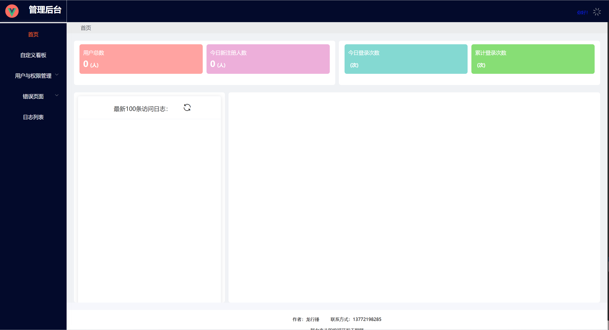

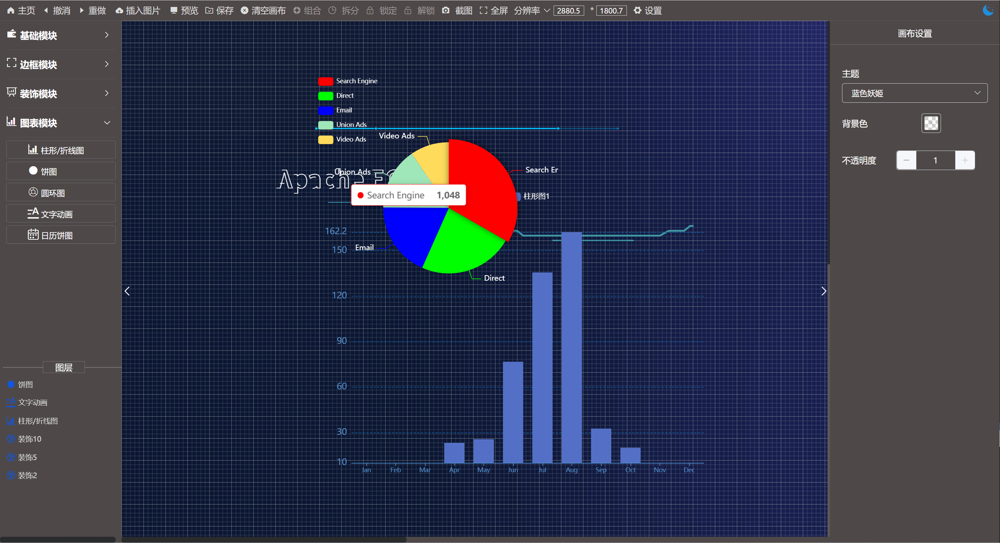

</details>

## 🍑联系方式

- 🍑 QQ：1035141145

## 🚀 快速开始

### 环境要求

- Node.js >= 16.x
- npm >= 8.x

### 安装运行

```bash
# 安装依赖
npm install

# 开发模式
npm run dev

# 生产打包
npm run build
```
