<div align="center">


# 壹孪 OneTwin

### AI 原生数字孪生可视化平台

**AI 智能体驱动 · 场景 API 开放 · 自然语言控制 · 毫秒级实时**

[](https://onetwin.cn)
[](https://onetwin.cn/docs)
[](https://gitee.com/wei_feng_qin/wantonly-drag-open)
[](https://github.com/1035141145/wantonly-drag-open)
[]()

[🚀 在线体验](#-快速体验) · [📖 文档](https://onetwin.cn/docs) · [🎬 演示视频](#-演示视频) · [💬 交流群](#-联系方式)

</div>

---

## 🚀 开源说明

本项目开源了**低代码编辑器的核心框架**，非完整版本。包含：

- ✅ 完整的拖拽式画布编辑器
- ✅ 少量示例拖拽组件
- ✅ 组件联动 / 事件 / 动画体系
- ✅ 本地数据持久化

你可以基于此框架自行扩展更多组件，对接后端数据库即可构建完整项目，在Vibe Coding，依托于这个基础框架，您可以轻松拓展自己的数据可视化平台。

> 💡  **完整商业版本** 包含更多组件、三维孪生引擎、**AI 智能体能力、场景 API 开放接口**、权限管理等。
> 💡 **如果这个项目对你有帮助，请给一个 ⭐ Star，**
---

## AI设计模式

AI智能体辅助设计，通过自然语言描述即可自动生成场景布局、推荐组件搭配，大幅降低设计门槛，提升搭建效率

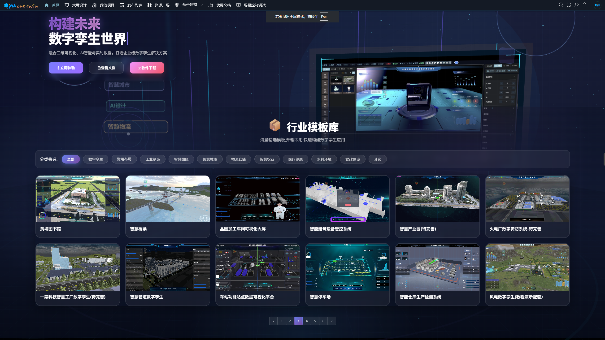
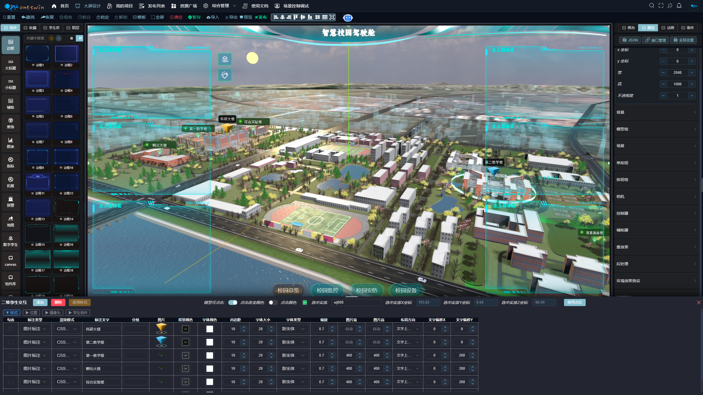


Agent模式流程（核心）

handleSubmitAgent(value, agentRefs)               [useAiChat.js L219]
  │
  ├─ 初始化: agentLogs=[], agentProgress=null, lastAgentResult=null
  ├─ 创建 AbortController
  ├─ 推入agentConversationHistory
  │
  ▼
agentLoop(userMessage, options)                   [agent-loop.js]
  │
  ├─ actionLayer = createEditorActionLayer()
  ├─ snapshotIndexBefore = snapshotStore.snapshotIndex
  │
  ▼
runOrchestrator(userMessage, options)             [orchestrator.js]
  │
  ├─ 创建 themeCtx = createThemeContext(canvasW, canvasH)
  │   初始值: {primaryColor:"#00e9db", secondaryColor:"#00c0e9",
  │           scene:"default", headerIndex:0, borderIndex:0, ...}
  │
  ├─ 继承 prevThemeContext.usedLayouts
  │
  ▼
┌─────────────────────────────────────────────────────────┐
│              analyzeIntent(userMessage, ...)             │
│                  [intent-analyzer.js]                    │
│                                                         │
│  1. 构建skill列表文本 (registry.list)                    │
│  2. 构建画布信息 (buildCanvasInfo)                       │
│  3. 调用 askAi() (最多重试2次)                           │
│  4. 解析AI返回JSON: extractJson() → JSON.parse()        │
│  5. 过滤无效skill                                       │
│  6. 返回 plan: {intent, skills, scene, reason,          │
│                clarifyOptions}                           │
└─────────────────────────────────────────────────────────┘
  │
  ├─ plan.intent === "clarify"
  │   → 返回 {text: 澄清选项, clarifyOptions: [...]}
  │
  ├─ plan.intent === "question" || skills.length === 0
  │   → 返回 {text: "无法识别操作意图"}
  │
  ├─ 正常流程继续 ↓
  │
  ├─ ═══ 自动追加 data-fill ═══
  │   ├─ 有design但没data-fill → 追加 data-fill
  │   └─ 有component-swap/add但没data-fill → 追加 data-fill(_pendingTargetIds)
  │
  ├─ ═══ 重试数据填充检测 ═══
  │   userMessage.match(/\[failedIds:([^\]]+)\]/)
  │   → 提取retryIds → 注入data-fill的params.targetIds
  │
  ▼
┌─────────────────────────────────────────────────────────┐
│              顺序执行 skill 链                            │
│                                                         │
│  for each skillPlan in plan.skills:                     │
│    │                                                    │
│    ├─ 获取 skill = registry.get(skillPlan.skill)        │
│    ├─ 构建 ctx = {themeContext, canvasState,             │
│    │     actionLayer, userMessage, planParams,           │
│    │     scene, onLog, imgUrl, signal, skipCurrentRef,   │
│    │     analyzeCanvas}                                  │
│    │                                                    │
│    ├─ _pendingTargetIds处理:                             │
│    │   从前面skill的result收集swappedIds/addedIds         │
│    │   → 作为data-fill的targetIds                        │
│    │   没收集到 → 跳过data-fill                           │
│    │                                                    │
│    ├─ 调用 skill.handler(ctx)                            │
│    │                                                    │
│    ├─ 收集结果: {skill, success, message,                │
│    │     themeUpdates, diagnoseData, failedIds}          │
│    │                                                    │
│    ├─ success && themeUpdates → 更新themeCtx             │
│    │                                                    │
│    └─ success===false && result.abort → 终止后续执行     │
└─────────────────────────────────────────────────────────┘
  │
  ▼
返回: {success, text, steps, themeContext, intent, scene,
       diagnoseData, failedFillIds}
  │
  ▼
结果处理 [useAiChat.js L283-341]
  │
  ├─ 更新 agentSteps (running → done)
  ├─ 保存 themeContext → savedThemeContext
  ├─ 推入 agentConversationHistory
  │
  ├─ clarifyOptions处理:
  │   intent==="clarify" → 显示澄清选项
  │
  ├─ diagnoseData处理:
  │   有actions → 填充diagnoseSuggestions(一键修复面板)
  │
  ├─ failedFillIds处理:
  │   有值 → 设置failedFillIds ref → 显示重试按钮
  │
  ├─ 构建displayContent → 更新list最后一个气泡
  └─ lock = false


## 🎮 三维孪生引擎

AI 智能体的"身体"——承载所有智能交互的三维场景引擎：

| 能力 | 说明 |
|:---|:---|
| 双引擎渲染 | Three.js + Cesium.js，覆盖室内/室外/地球级场景 |
| 二维组件与场景完美融合 | 任意的二维组件都能轻松融入三维场景中，CSS2D、CSS3D|
| 单按钮、按钮组交互 | 通过单按钮和按钮组，轻松实现数字孪生复杂的场景交互设计 |
| 模型编辑器 | 内置轻量级编辑器，导入即编辑 |
| 工业元宇宙 | 第一/三人称漫游，碰撞检测，多角色，角色靠近触发场景事件，实现工业元宇宙 |
| 着色器特效 | 集成60+独立场景和模型材质着色器，发光/波纹/火焰/管道流动/城市扫描等等一键应用 |
| 后处理 | 辉光/亮度/对比度/赛博朋克预设 |
| 材质替换 | 材质快选快换，支持金属度光泽度、透明度 |
| 环境预设 | 日出/夜景/工业风一键切换 |
| 远程遥控 | API 控制相机/模型/动画，手机端操控大屏 |
| 环境预设 | 日出/夜景/工业风一键切换 |
| 场景API开放 | 场景功能可以通过API毫秒级调用触发，为对接外部智能体对接提供简单的控制方案 |
---


---

> **AI 不只是辅助工具，它是数字孪生的灵魂。**
>
> 壹孪让 AI 智能体直接驱动数字孪生场景——说一句话，场景即响应；接一个智能体，场景即联动。

---

## 🤖 AI 智能体：数字孪生的核心引擎

壹孪的 AI 不是"锦上添花"，而是整个平台的中枢神经。AI 智能体通过标准化接口与数字孪生场景深度耦合，实现从感知、理解到决策、执行的完整闭环。

### Vosk语音引擎+智能体模式

AI 智能体通过自然语言理解用户意图，自动转换为标准化的场景控制指令并执行：

```
用户说话 → NLP 理解意图 → 识别需求类型 → 生成指令 JSON → 验证指令 → 执行操作
```

- **自然语言驱动** — 说"巡检 A 栋"，AI 自动定位建筑、规划路径、切换视角
- **指令自动生成** — AI 将语义转换为标准 JSON 指令，无需手动编码
- **安全验证机制** — 指令执行前自动校验，异常指令拦截并返回提示

### 场景 API 能力开放 — 对接外部智能体

壹孪将数字孪生场景的完整控制能力通过标准化 API 暴露，**任何外部智能体都可以无缝接入**：

| API 类别 | 能力 |
|:---|:---|
| **相机 API** | 视角切换 / 重置 / 自动跟随 / 漫游 |
| **模型 API** | 显隐 / 高亮 / 移动 / 旋转 / 缩放 |
| **特效 API** | 光效 / 着色器 / 场景预设 / 雾效 |
| **动画 API** | 播放 / 停止 / 速度 / 循环 / 权重 |
| **UI 交互 API** | 标注 / 按钮组 / 面板 / 公告 |

> 💡 **你可以用任何 AI 框架（LangChain / AutoGen / Dify / 自研智能体）对接壹孪场景**，只需通过 WebSocket 发送标准指令即可实现智能体对数字孪生场景的完全控制。

### WebSocket 实时通信协议

基于 WebSocket 的双向实时通信，支持 20+ 种控制指令，毫秒级响应：

```
AI 调用 → 控制层分发 → 相机/模型/特效/动画/UI → 场景实时更新 → 用户看到变化
```

### 智能场景联动控制

AI 根据业务规则自动触发多对象联动，实现真正的"智能孪生"：

```
传感器异常 → AI 评估风险 → 分级响应（紧急/预警/记录）→ 聚焦 + 高亮 + 特效 + 告警 → 场景实时更新
```

- **设备巡检路径规划** — AI 自动规划最优巡检路线
- **异常告警可视化** — 风险分级，自动聚焦异常点、高亮显示、弹出告警
- **动态视角切换** — 根据事件类型自动切换最佳观察视角

### 控制调试界面

具备清晰明朗的API控制调试工具，轻松完成调试

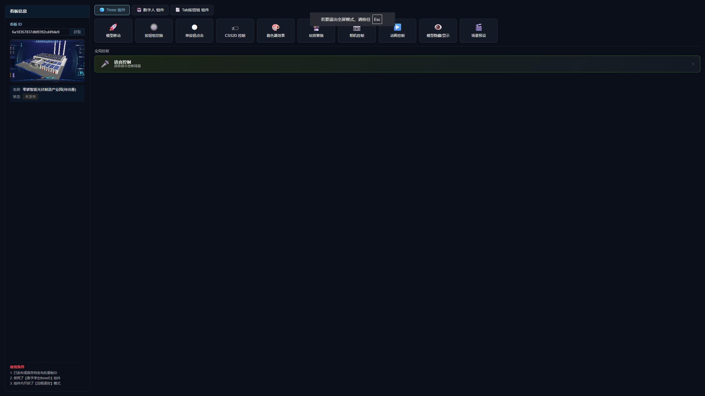
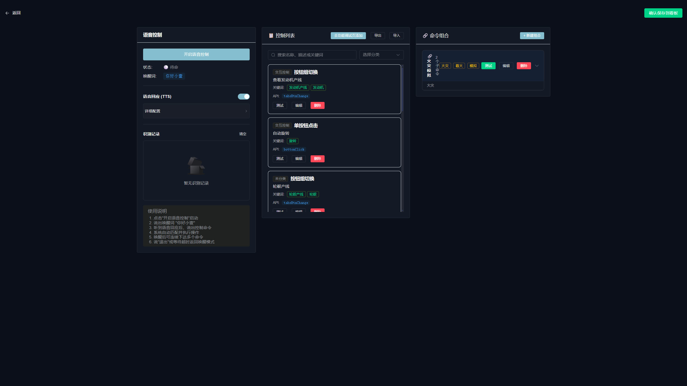

### AI 能力矩阵

| 能力 | 说明 |
|:---|:---|
| 🧠 **AI 智能体模式** | 自然语言 → 指令解析 → 场景控制，全链路自动化 |
| 🔌 **场景 API 开放** | 标准化接口，支持对接任意外部智能体 |
| 🎨 **AI 生成 3D 组件** | 大模型驱动，描述即生成 |
| 🎙️ **语音控制场景** | 语音指令驱动模型显隐、相机视角、动画播放 |
| 🗺️ **智能巡检路径** | AI 自动规划巡检路线，第一/三人称漫游 |
| � **场景联动控制** | AI 自动触发多对象联动，异常告警可视化 |
| 🧑‍💼 **数字人播报** | 文字转语音、多角色切换、远程 API 操控 |

---


## 🖼️ 效果预览

> 📸 以下为真实项目截图，非设计稿

<details>
<summary><b>📺 点击展开效果预览</b></summary>

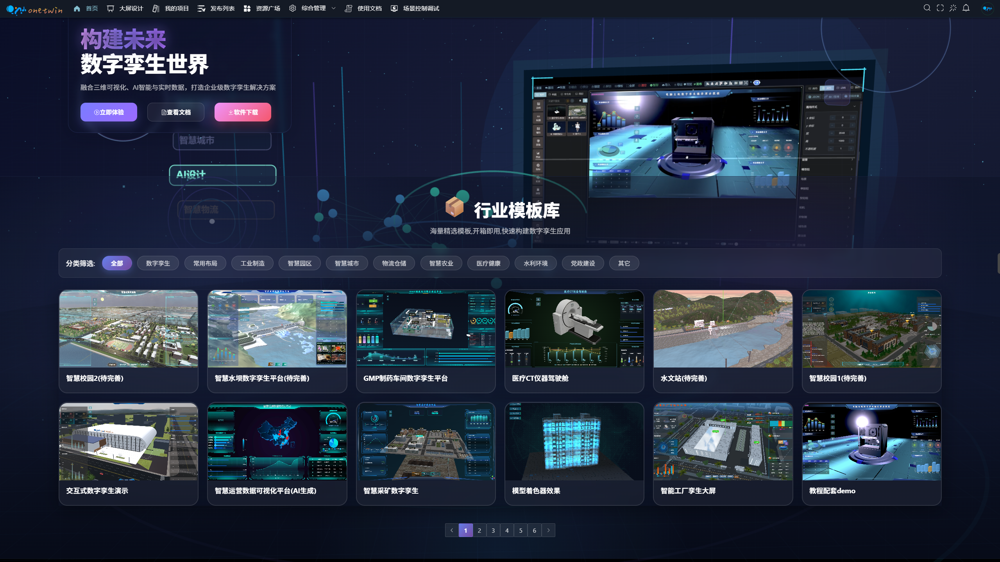
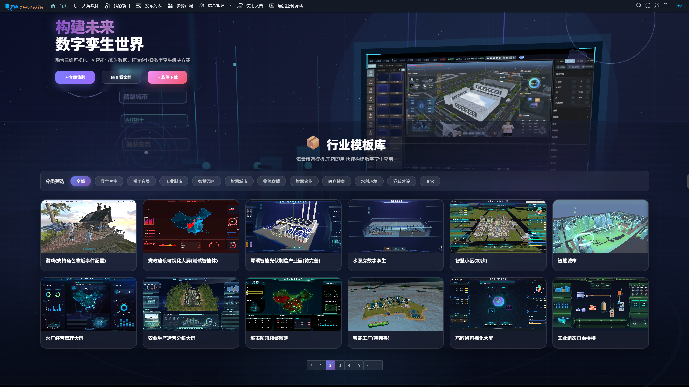
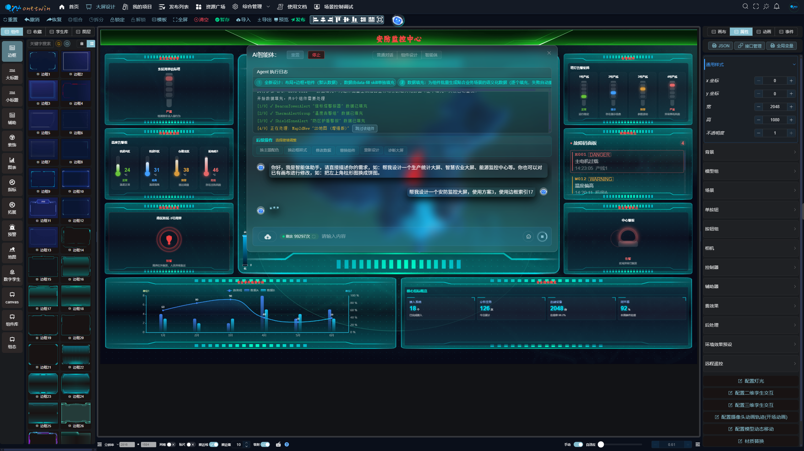
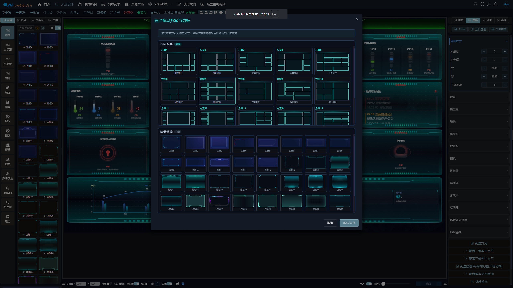


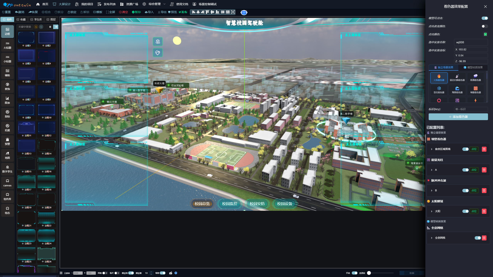
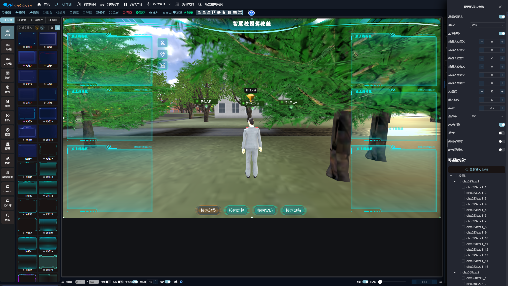
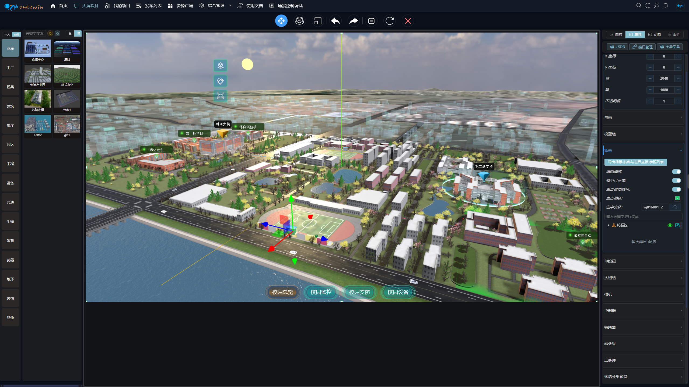


</details>

<details>
<summary><b>📺 点击展开旧版效果对比</b></summary>

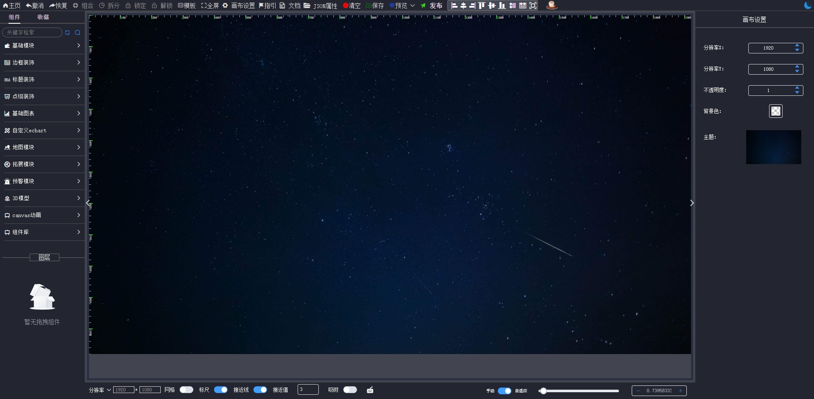
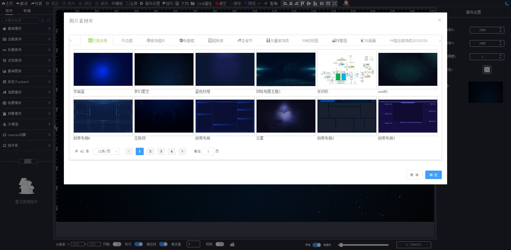
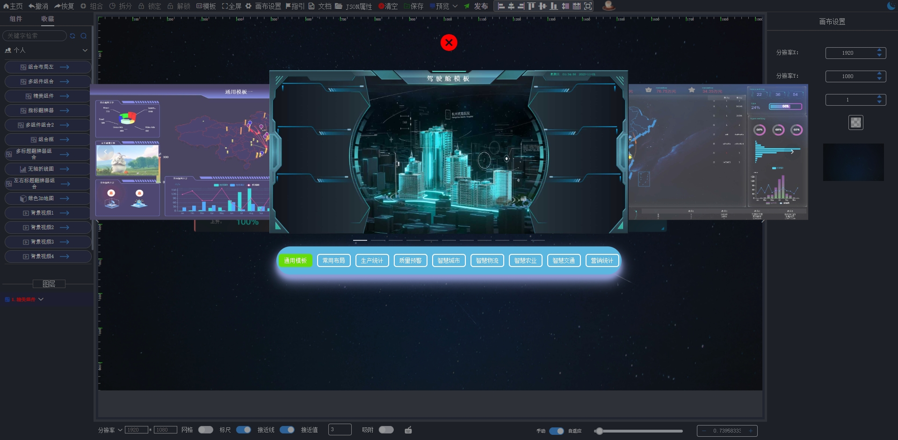
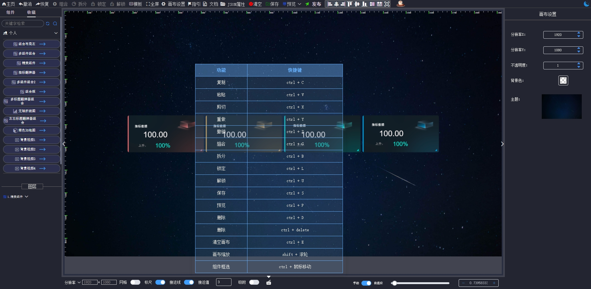
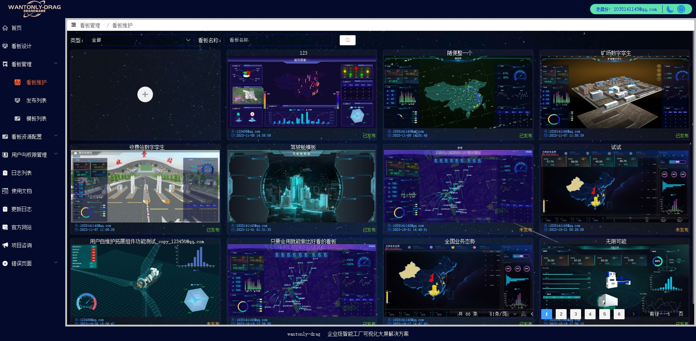
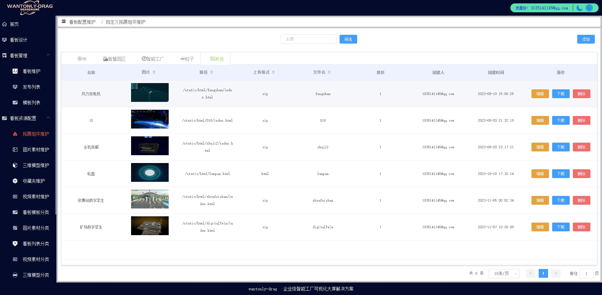

</details>

---

## 🧩 功能全景

### 组态编辑器

| 功能 | 状态 | 说明 |
|:---|:---:|:---|
| 拖拽式画布 | ✅ | 自由拖拽、对齐吸附、网格辅助 |
| 组件联动 | ✅ | 组件间事件驱动联动 |
| 快捷键操作 | ✅ | 复制/粘贴/剪切/撤销/重做 |
| 图层管理 | ✅ | 层级调整、锁定/隐藏 |
| 组件组合拆分 | ✅ | 多组件组合为 Group |
| 三维样式转换 | ✅ | 2D 组件一键 3D 化 |
| 绑定事件/动画 | ✅ | 丰富的交互配置 |
| 统一接口管理 | ✅ | 全局 API 配置与复用 |
| 在线编码拓展 | ✅ | 自定义组件开发 |
| 跨框架上传组件 | ✅ | Vue/React 组件包上传 |
| 单大屏一键导出 | ✅ | 独立部署无依赖 |
| 屏幕自适应 | ✅ | 自研算法，一套设计适配所有分辨率 |

### 素材管理

| 功能 | 状态 |
|:---|:---:|
| 图片素材 | ✅ |
| 视频素材 | ✅ |
| 三维模型 | ✅ |
| 音频素材 | ✅ |
| HDR 素材 | ✅ |
| 收藏夹 | ✅ |

### 三维孪生引擎

| 功能 | 状态 | 说明 |
|:---|:---:|:---|
| 模型导入 | ✅ | `.glb` / `.gltf` 等主流格式 |
| 模型动画 | ✅ | 播放控制、参数配置 |
| 相机配置 | ✅ | 位置 / 角度 / FOV |
| 背景配置 | ✅ | 全景图 / HDR 环境映射 |
| 控制器配置 | ✅ | 缩放阻尼 / 自动旋转 / 俯仰角限制 |
| 二维孪生交互 | ✅ | 2D 组件嵌入 3D 场景 |
| 三维孪生交互 | ✅ | 3D 广告牌 / 视频嵌入 |
| 辅助器 | ✅ | 网格 / 坐标轴 / 帧率 |
| 单按钮配置 | ✅ | 自动旋转 / 相机切换 / 动画控制 / 材质替换 / 环境效果 |
| 按钮组配置 | ✅ | 批量场景事件控制 |
| 模型编辑器 | ✅ | 内置轻量级编辑器 |
| 模型层级管理 | ✅ | 结构树 / 事件绑定 |
| 模型点击事件 | ✅ | CSS2D / CSS3D / 动画 / 材质 / 隐藏显示 |
| 角色靠近事件 | ✅ | 自动讲解 / 区域预警 / 互动触发 |
| 灯光配置 | ✅ | 环境光 / 点光源 / 平行光 / 聚光灯 |
| 雾效果 | ✅ | 线性雾 / 指数雾 |
| 后处理 | ✅ | 辉光 / 亮度 / 对比度 / 赛博朋克预设等 |
| 环境预设 | ✅ | 日出 / 夜景 / 工业风一键切换 |
| 机器人巡检 | ✅ | 第一/三人称漫游 / 碰撞检测 / 多角色 |
| 摄像机轨迹动画 | ✅ | 关键帧编辑 / 开场动画 |
| 模型动态移动 | ✅ | 路径移动 / API 控制位置 |
| 流动线条轨迹 | ✅ | 数据流线 / 物流轨迹 |
| 着色器效果 | ✅ | 自定义 Shader / 发光 / 波纹 / 火焰 / 管道流动 |
| 材质替换 | ✅ | 颜色 / 透明度 / 金属度 / 游戏级效果 |
| 远程遥控 | ✅ | API 控制相机 / 模型 / 动画 |
| API 调试器 | ✅ | 内置调试面板 |
| 出场动画 | ✅ | 模型 / 相机 / 灯光 |

### 运维管理

| 功能 | 状态 | 说明 |
|:---|:---:|:---|
| 看板上下架 | ✅ | 一键上架 / 在线变更 / 安全下架 |
| 公告推送 | ✅ | 全局广播 / 定向通知 / 紧急告警 |
| 一键发布 | ✅ | 自动生成访问链接 |
| 独立项目导出 | ✅ | 私有化部署，数据自主可控 |

---

## 🌐 版本对比

| 特性 | 旧版本 | 壹孪新版本 |
|:---|:---:|:---:|
| 技术栈 | Vue2 + Webpack | **Vue3 + Vite + Pinia** |
| AI 智能体 | — | **DeepSeek 大模型 + 场景 API 开放** |
| 外部智能体对接 | — | **标准化接口，任意框架接入** |
| 语音控制 | — | **自然语言驱动场景交互** |
| 数字人播报 | — | **多角色 / API 操控** |
| 三维孪生场景 | 丰富 | **覆盖绝大部分场景需求** |
| 模型编辑器 | — | **内置轻量编辑器** |
| 远程遥控 | — | **API 多端联动** |
| 编辑器体验 | 基础 | **流畅 · 美观 · 专业** |
| 数据隔离 | 共享 | **用户独立** |
| 费用 | 个人免费 | **个人免费** |
| 私有化部署 | 支持 | **支持** |
| 独立项目导出 | — | **一键导出独立部署** |
| 源码购买 | 支持 | **大型企业支持 · 版权买断** |

---

## 🚀 快速体验

| 版本 | 地址 | 账号 | 密码 |
|:---|:---|:---|:---|
| **新版** | [onetwin.cn](https://onetwin.cn) | `test` | `123456` |
| 旧版 | [wantonly-drag.com.cn](http://wantonly-drag.com.cn) | `123456@qq.com` | `123456` |

---

## 📺 演示视频

🎬 [B 站演示视频 1](https://www.bilibili.com/video/BV1orQJB2Ehz/) · [2](https://www.bilibili.com/video/BV1t4D7BxEL5/) · [3](https://www.bilibili.com/video/BV1aMbTzwEmp/) · [4](https://www.bilibili.com/video/BV1gqmzB7Ej9/) · [5](https://www.bilibili.com/video/BV1t48ue3ErW/) · [6](https://www.bilibili.com/video/BV1p8ktBRE4K/)

---

## 🖼️ 版权归属


---

## 🛠️ 快速开始

### 环境要求

- Node.js >= 16.x
- npm >= 8.x

### 安装运行

```bash
# 安装依赖
npm install

# 开发模式
npm run dev

# 生产打包
npm run build
```

---

## 🤝 参与贡献

这是一个**个人独立开发**的项目，目前正在寻找：

- 🧑‍💻 **技术合作伙伴** — 一起打磨产品
- 💰 **投资方** — 加速商业化落地
- 🏢 **企业客户** — 付费私有化部署 / 源码购买 / 版权买断

如果你看好这个项目，欢迎以任何形式合作。

---

## 🍑 联系方式

<p align="center">

**QQ**: 1035141145

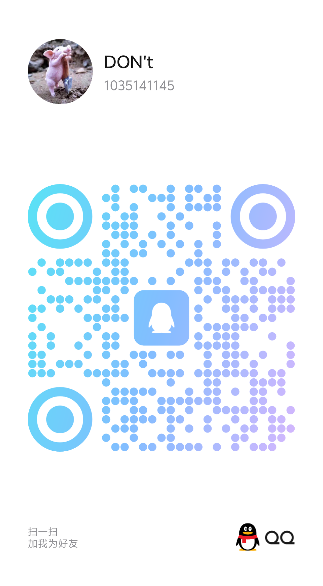

**微信**


**🌟 关注公众号，获取更多资讯 🌟**


</p>


<div align="center">

**如果这个项目对你有帮助，请给一个 ⭐ Star，这是对独立开发者最大的支持！**


</div>
